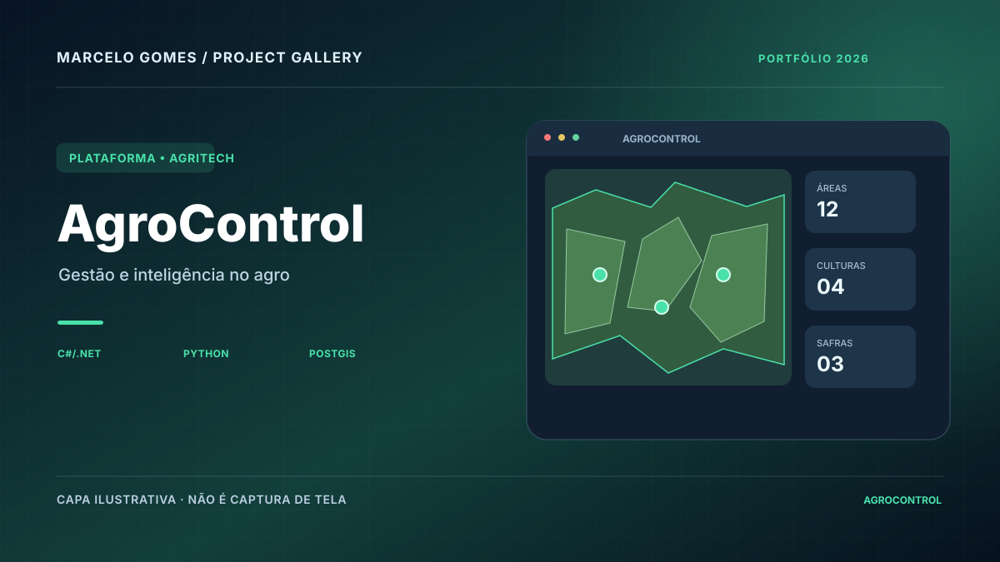
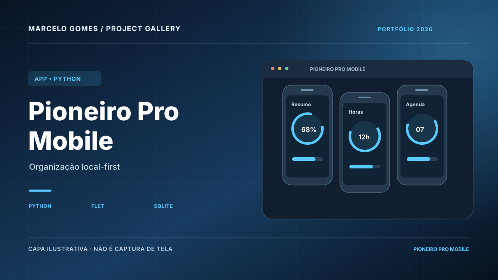
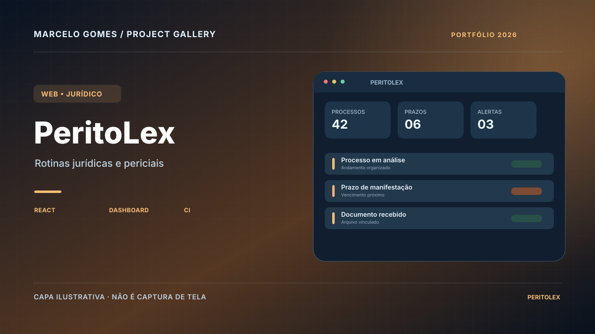

# Marcelo Gomes | Portfólio

Repositório do meu portfólio profissional publicado com GitHub Pages.

## Objetivo

Apresentar projetos, habilidades e evolução técnica com foco em **desenvolvimento de software web e mobile, Python, cloud, DevOps, automação, observabilidade e soluções para problemas reais**.

## Projetos em destaque

- **AgroControl** — plataforma modular com C#/.NET, Python/FastAPI, Java/Spring Boot, React, PostGIS, Docker/Kubernetes e CI/CD.
- **Pioneiro Pro Mobile** — aplicativo local-first em Python/Flet com SQLite, geolocalização, testes e pipeline de release.
- **PeritoLex** — organização de processos, prazos, documentos e alertas, com CI e containerização.
- **GeoTerritórios** — organização territorial, mapas, endereços e indicadores de cobertura.
- **Pioneiro Pro** — organização operacional, acompanhamento de atividades e produtividade.
- **AMM Materiais de Construção** — presença digital e ferramentas web aplicadas a um negócio real.
- **AWS Monitoring Lab** — laboratório de monitoramento e observabilidade.
- **Terraform AWS Lab** — infraestrutura versionada com Infrastructure as Code.

## Áreas de foco

- Desenvolvimento backend com C#/.NET, Python/FastAPI e Java/Spring Boot
- Desenvolvimento mobile com Python e Flet
- Desenvolvimento web com React, Vite e JavaScript
- Testes e validações automatizadas
- Docker e containers
- GitHub Actions e CI/CD
- AWS e arquitetura em nuvem
- Terraform e Infrastructure as Code
- Dashboards e visualização de dados
- Monitoramento e observabilidade
- Python e automação

## Estrutura do portfólio

O site é uma aplicação estática publicada via GitHub Pages e organizada em páginas dedicadas a projetos, infraestrutura, trajetória, soluções e posicionamento profissional.

O repositório também inclui materiais de identidade visual, página 404, favicon, banner social e arquivos auxiliares de publicação.

## Links

- Portfólio: https://m4rc3low.github.io
- GitHub: https://github.com/M4rc3low
- LinkedIn: https://www.linkedin.com/in/marcelo-s-gomes/

## Status

Portfólio em evolução contínua, atualizado conforme novos projetos e competências são consolidados.

## Galeria visual de projetos

A [galeria de projetos](https://m4rc3low.github.io/projetos.html) apresenta 15 capas ilustrativas originais para os 20 repositórios deste perfil (incluindo versões relacionadas e exercícios). As capas são **conceituais**, não capturas reais dos sistemas.

| AgroControl | Pioneiro Pro Mobile | PeritoLex |
|:--:|:--:|:--:|
|  |  |  |

Outras capas: [GeoTerritórios](assets/projects/geoterritorios.svg) · [AMM](assets/projects/amm-materiais.svg) · [Horizonte Azul](assets/projects/horizonte-azul.svg) · [Diário de Leitura](assets/projects/diario-leitura.svg) · [Relatório Mensal](assets/projects/relatorio-mensal.svg) · [Infraestrutura](https://m4rc3low.github.io/projetos.html#infraestrutura).

A nomenclatura e a finalidade de cada capa estão documentadas em [assets/projects/README.md](assets/projects/README.md). Capturas reais, quando feitas, devem permanecer em pasta separada e mostrar dados fictícios.
